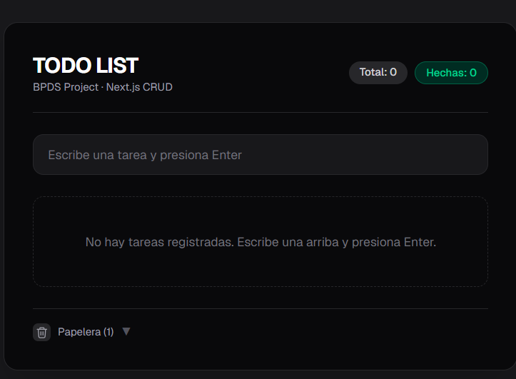
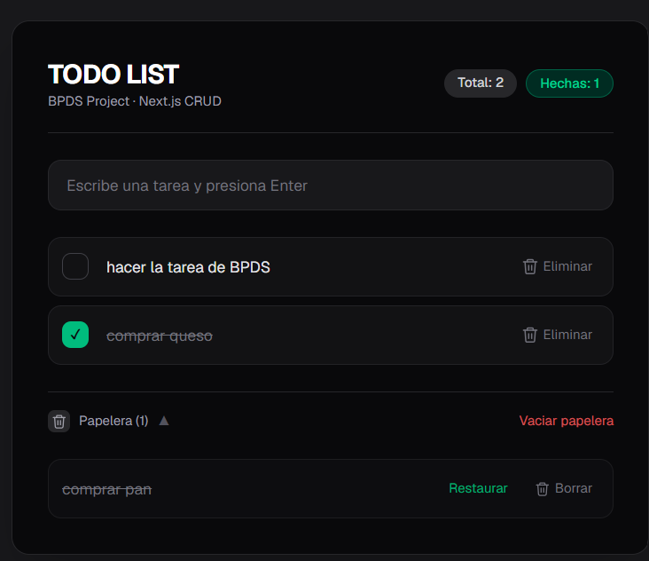
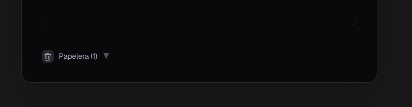
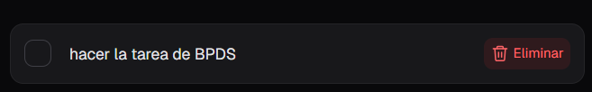
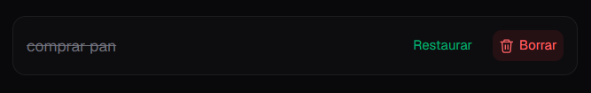

# titulo del proyecto 

TODO LIST

# Descripción

este proyecto es un TODO LIST que tiene el proposito de gestionar tareas y cambiarlas a hechas o eliminarlas ademas de poder recuperarlas de la papelera,otro proposito es sacar un 5.0 en la materia 

# Funcionalidades principales

- Funcionalidad 1 ( gestión de tareas)
- Funcionalidad 2 (eliminara tareas )
- funcionalidad 3 (cambiar de estado una tarea a hecha )
- Funcionalidad 4 (contador de tareas y tareas completadas )
- Papelera: permite recuperar o eliminar definitivamente elementos borrados previamente.

# Capturas de pantalla

esta captura es del menu del TODO LIST

esta capturta muestra la sfunciones que tiene el TODO LIST, el crear una tarea , completarla , moverla a la papelera y el borrarla definitivamente 

# Funcionalidad de papelera

La papelera permite gestionar los elementos eliminados sin perderlos de forma permanente:

Al eliminar un elemento, este no se borra inmediatamente, sino que se mueve a la papelera.
Desde la papelera, el usuario puede restaurar un elemento para devolverlo a su ubicación original.
ambién puede eliminar definitivamente un elemento desde la papelera, lo cual sí borra el registro de forma permanente.

icono de la papelera 

icono de eliminar

icono de borrar tarea definitivamente 

# Instalación

Clona el repositorio e instala las dependencias:

git bash
git clone https://github.com/theron102/BPDS.git
cd bpds
npm install

Este comando lee el archivo `package.json` del proyecto y descarga automáticamente todas las librerías necesarias para su funcionamiento (Next.js, React, entre otras), guardándolas en la carpeta `node_modules`. Este paso solo es necesario la primera vez, o cada vez que se agreguen nuevas dependencias al proyecto.

# Ejecución local

Para correr el proyecto en modo desarrollo:

git bash
npm run dev

Este comando inicia un servidor de desarrollo local:
 [http://localhost:3000](http://localhost:3000)

Ahí podremos ver la aplicación funcionando. Cualquier cambio que se realice en el código se reflejará automáticamente en el navegador sin necesidad de reiniciar el servidor.

# Integrantes del equipo

- MATIAS MORALES RODRIQUEZ — matiasmorazul198720-blip
- REATIGA VILLADIEGO KEVIN ANDRES — Noxus2OO7
- SANTIZ MESTRE SEBASTIAN — 
- PALOMINO PINZON GABRIEL — theron102